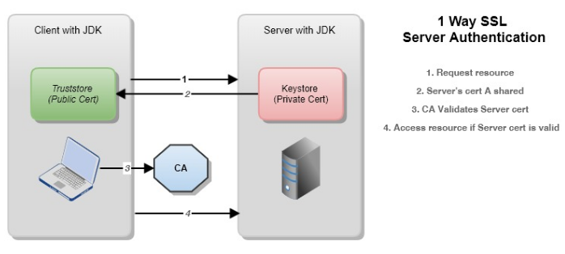
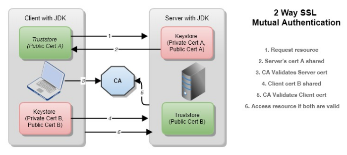

# Secure Sockets Layer. SSL.

## Contents at a Glance.
* [About](#about)
* [Documentation.](#documentation)
* [Pros.](#pros)
* [Cons.](#cons)
* [1-Way SSL Server Authentication.](#1-way-ssl-server-authentication)
* [2-Way SSL Mutual Authentication.](#2-way-ssl-mutual-authentication)
* [Help](#help)

## About.

## Documentation.

## Pros.

## Cons.

## 1-Way SSL Server Authentication.

## 2-Way SSL Mutual Authentication.

## Help.
